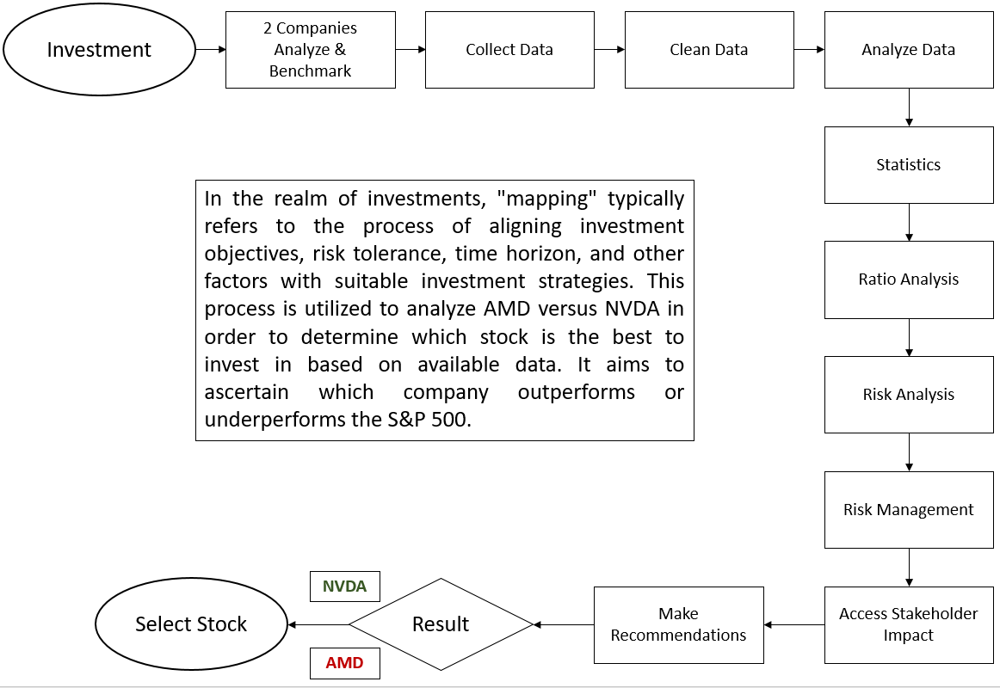

  
<h1 align="center">AMD vs NVDA</h1>  

### Description:  
#### Applying the comprehensive knowledge and methodologies gleaned from the Master of Analyst Program (MAP) to perform in-depth stock analysis. MAP, a postgraduate program, is meticulously designed to refine individuals' expertise across diverse domains like data analysis, business analysis, and financial analysis, among other analytical disciplines. Participants acquire the essential proficiency and knowledge crucial for effectively gathering, scrutinizing, and interpreting data, enabling informed decision-making within their respective professional domains.  

# Prerequistes
Excel 2016  
Python 3.6+  
Jupyter Notebook Python 3   
R 3.0.0 +  

# Data
#### Yahoo Finance  
https://finance.yahoo.com/quote/AMD?.tsrc=fin-srch    
https://finance.yahoo.com/quote/NVDA?.tsrc=fin-srch  
https://finance.yahoo.com/quote/%5ESPX?.tsrc=fin-srch   

## Investment Process Mapping  
   

### 6	Courses  
#### (1)	Fundamentals of Systematic Analysis  
-	Completed Staff Work (CSW)  
 Completed Staff Work, similar to data analysis, empowers decision makers to identify solutions to problems or address issues through the careful consideration of reasonable and workable alternatives.  
#### 7 Steps to CSW:      
1. Identify, describe, or define the problems.  
2. Gather or compile information about the problem.  
3. Organize information for review & consideration.  
4. Analyze or evaluate the information.  
5. Develop, compile or generate alternatives.  
6. Select or identify the solution you want to recommend based on the results of your objective analysis.  
7. Develop a plan to implement the solution and the documents necessary to authorize the implementation.  

#### (2)	Critical Thinking Skills  
* Critical thinking examines assumptions  
* Discerns hidden values  
* Evaluates evidence  
* Assesses conclusions  

#### (3)	Research Methods  
* The Research Process   
* Three Research Approaches   
* Getting Started  
* Quantitative Research Methods   
* Qualitative Research Methods
  
#### (4)	Effective Project Management  
They have a solid grasp of project management, including the roles of project managers, common project management principles, various tools and techniques, and the phases of a project's life cycle, which encompass planning, execution, control, and closure.    
Project Definition:  
* Defined Beginning and end
* Not a program
* Specific outcome
* Unique
* Risks
* Multiple tasks

#### (5)	Writing Skills  
* Write clearly and concisely  
* Access your writing skills and improve writing  
* Write specifically for your audience   
* Write a powerful sentences and paragraph  
* Learn taking on various types of reports
* Learn to edits yourself and others

#### (6)	Presenting Analytical Reports  
* Utilize these courses to enhance my work and projects.   
* Research Question: Which company, AMD or Nvidia, is more likely to outperform the SP500 market in
long term investment?  
* Independent Variable: Choice between AMD and Nvidia for long-term investment.  
* Dependent Variable: The relative performance of the chosen company's stock compared to the S&P 500   
market index over the long term.  
* Stakeholders: Investors, Retail Traders, Investment Firms, CalPERS and CalSTR  
* Data type: Comparison  
* Variable/Instruments: Knowledge, Performance, Test (Calculate risk, average returns, Sharpe Ratio, etc.), Technical Analysis     
* Existing Data: Records/Documents Review  
* Data Need: Historical Price Data  

    

## Author:   
### Tin Hang

## Disclaimer
### 🔴 This is not financial advice. Please conduct your own research and refrain from using this code for investing or trading in stocks. If you are interested in the stock market, consider reading books on investment, trading, and finance. It is advisable to consult with a professional investment advisor before making any investment decisions. Remember, this information is for educational purposes only.  
